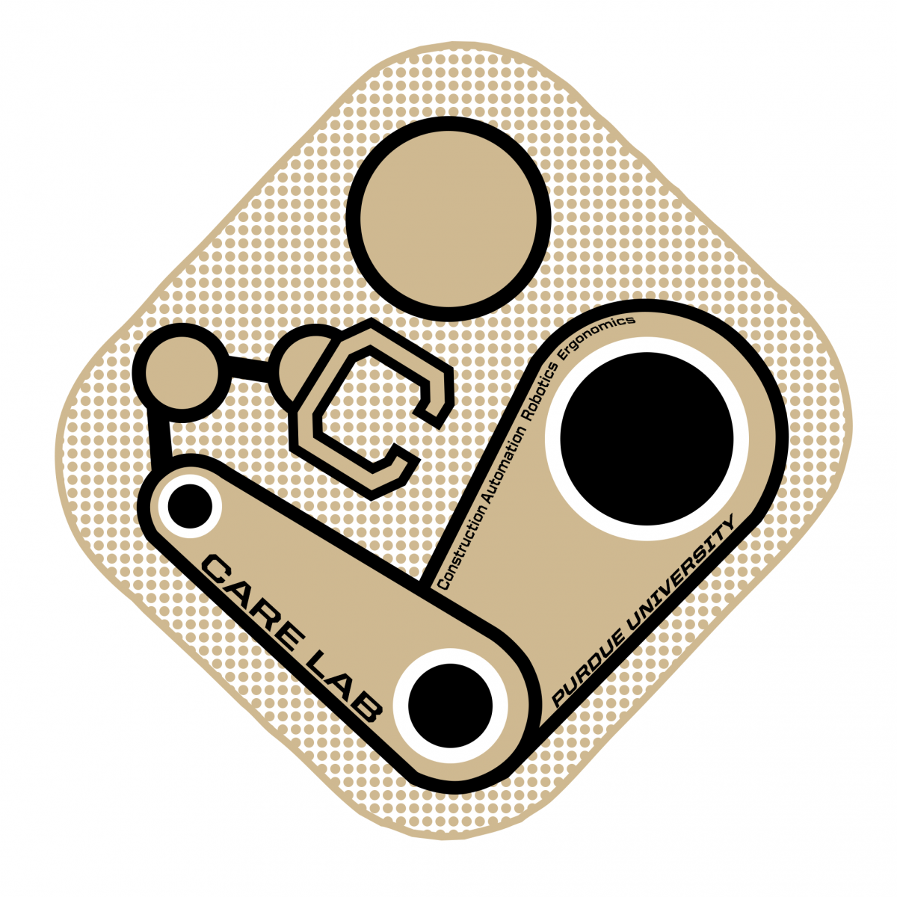

  

<h1 align="center">Purdue CARE Lab</h1>

  <strong>Construction Automation, Robotics, and Ergonomics</strong> 
  Purdue University · Purdue Polytechnic Institute

The **Construction Automation, Robotics, and Ergonomics (CARE) Lab** at Purdue University pursues advancements in **automation, robotics, and ergonomics for construction and transportation**.

Our research integrates intelligent systems, automation technologies, human factors, and computational methods to improve **human well-being, production efficiency, safety, and environmental sustainability**.

## Research Areas

### Automation

We develop automation technologies and computational approaches to streamline construction processes and improve productivity and system compatibility.

### Robotics

We develop intelligent robotic systems to improve efficiency, autonomy, and safety in construction and transportation applications.

### Ergonomics

We apply human factors theories and technologies to improve human–environment and human–system interaction.

Together, these research areas support the development of safer, smarter, more productive, and more sustainable built environments.

## GitHub Projects

This organization hosts software, simulation frameworks, research prototypes, datasets, and other open-source resources developed by the CARE Lab.

Research repositories and supporting resources will be made publicly available as projects mature and research results are released.

## People

### Director

**[Yunfeng Chen](https://polytechnic.purdue.edu/profile/chen428), Ph.D.**  
Associate Professor  
Purdue University

### Ph.D. Students

- Xinran Hu
- Bingzhen Li
- Yipeng Wei
- Ze Wang
- **[Hongyu Tu](https://h-tu.github.io/)**

For the current research team and alumni, visit the [CARE Lab website](https://polytechnic.purdue.edu/facilities/construction-automation-robotics-and-ergonomics-lab).

## Links

- [CARE Lab Website](https://polytechnic.purdue.edu/facilities/construction-automation-robotics-and-ergonomics-lab)
- [Research](https://polytechnic.purdue.edu/facilities/construction-automation-robotics-and-ergonomics-lab/research)
- [Publications](https://polytechnic.purdue.edu/facilities/construction-automation-robotics-and-ergonomics-lab/publications)
- [Collaborators](https://polytechnic.purdue.edu/facilities/construction-automation-robotics-and-ergonomics-lab/collaborators)
- [Job Vacancies](https://polytechnic.purdue.edu/facilities/construction-automation-robotics-and-ergonomics-lab/job-vacancies)
- [Contact](https://polytechnic.purdue.edu/facilities/construction-automation-robotics-and-ergonomics-lab/contact)

## Location

**Construction Automation, Robotics, and Ergonomics (CARE) Lab**  
DUDL 5376  
Purdue University  
West Lafayette, Indiana, USA